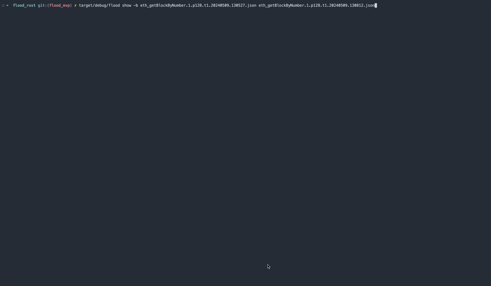

# Flood Rust:
`Flood Rust` is a Rust rewrite of Flood based on [Latte](https://github.com/pkolaczk/latte) a performance benchmarking tool for CassandraDB. Currently, `flood_rust` can benchmark RPC node performance of individual JSON-RPC requests and series of JSON-RPC requests across a variety of parameters inputed manually or from an input file. For each benchmark, `flood_rust` defines a `Workload` which may contain one or more JSON-RPC requests and repeatedly executes cycles of the workload. The user may define the `--rate  [req/s]`. The execution time of a `Workload` cycle are recorded as well as the timing and success of individual JSON-RPC calls are recorded.

If one requests is specified then one requests is executed per benchmark cycle. If multiple are specified either via multiple requests with different methods or by the same requests with different parameters all requests are executed in order sequentially within a single benchmark cycle. Each requests is individually timed and the time to executed a total workload cycle (one or multiple requests) is recorded.
 
## Commands
- `run <METHOD> [<PARAMS>..]`

    
    - Flags:
        - `--raw`: Send raw JSON parameters, The first param will be interpreted as a raw JSON array of params.
        - For Example: `flood run eth_getBlockByNumber '["0x123", false]' --raw => {"method": "eth_getBlockByNumber", "params": ["0x123", false] ... }`
        - `--rate [<RATE>..]`: Rate or req/s to send per second.
        - `--warmup_duration <NUM_CYCLES>`: Duration of the warmup phase in number of workload cycles.
        - `--run_duration <SECONDS>`: Duration of main benchmark phase in seconds.
        - `--threads <NUM_THREADS>`: Number of worker threads used by the driver.
        - `--concurrency <NUM_CONCURRENCY> `: Max number of concurrent async requests (workloads) per thread during the main benchmark phase.
        - `--sampling_interval <PERIOD>`: Throughput sampling period, in seconds.
        - `--tags <TAG>`: Label that will be added to the report to help identifying the test.
        - `--input <FILE_PATH>`: Path to JSON input falls with listed JSON-RPC calls.
        - `--output <FILE_PATH>`: Path to an output file or directory where the JSON report should be written to.
        - `--baseline <REPORT_PATH>`: Path to a report from another earlier run that should be compared to side-by-side.
        - `--quiet`: Don't display the progress bar.
        - `--random`: On each workload cycle execution randomly suffle and execute all provided JSON-RPC requests.
        - `--choose`: On each workload cycle randomly choose on of the provided JSON-RPC requests to execute, this differs from `--random` as only one requests from the provided list.
        - `--rpc-url [<RPC_URL>..]`: Rpc url of ethereume node.
        - `--exp-ramp`: Utility function to benchmark rates of powers of ten ([10, 100, ..., 1000000] req/s).
        - `--timestamp`: Seconds since 1970-01-01T00:00:00Z
- `show <JSON_PATH>`: Display results of a benchmark run in cli

    
    - Flags:
        - `--baseline <JSON_PATH>`: Relative Path to <REPORT>.json file to compare against as baseline
- `hdr <JSON_PATH>`: Export histograms as a compressed HDR interval log for use with HdrHistogram (https://github.com/HdrHistogram/HdrHistogram).
    - Flags:
        - `--output <FILE_PATH>`: Path to an output file  where the plot the hdr log should be written to. 
        - `--tag <TAG>`: tag prefix for each histogram
- `plot [<JSON_PATH>..]`: Plots the data from reports at sampling intervals as an `.svg` image in the local directory
    - Flags
        - `--throughput`: Throughput [req/s] vs Time [s]
        - `--precentile: <PERCENTILE>`: Response Time [ms] vs Time [s] for a provided Response Time percentile.
            - `PERCENTILES`: input_values = {MIN, 25,, 50, 75, 90, 95, 99, 99.9, 99,99, MAX}
        - `--success_rate`: Request Success Rate [%] vs Time [s]
        - `--success_rate --throughput`: Request Success Rate [%] vs Throughput [req/s]
        - `--output <FILE_PATH>`: Path to an output file or directory where the plot `.svg` should be written to.


## Examples:

[JSON-RPC Reference](https://ethereum.org/en/developers/docs/apis/json-rpc)

#### Single JSON-RPC
```bash
cargo b --bins

# Max rate
target/debug/flood run eth_getBlockByNumber "0x1b4 true" --rpc-url [<RPC_URL>..]
# 100 req/s
target/debug/flood run eth_getBlockByNumber "0x1b4 true" --rpc-url [<RPC_URL>..] --rate 100
# Perform multiple benchmarsk for 100 req/s, 10 req/s, 1000 req/s
target/debug/flood run eth_getStorageAt "0x295a70b2de5e3953354a6a8344e616ed314d7251 0x0 latest" --rpc-url [<RPC_URL>..] --rate 100 10 1000
```

#### Single JSON-RPC with expoential ramp up -> Generates a list of rates powers of 10.
```bash
cargo b --bins

target/debug/flood run eth_getBlockByNumber "0x1b4 true" --rpc-url [<RPC_URL>..] --exp-ramp
target/debug/flood run eth_getStorageAt "0x295a70b2de5e3953354a6a8344e616ed314d7251 0x0 latest" --rpc-url [<RPC_URL>..] --exp-ramp
```

#### Multiple JSON-RPC requests with different parameters executed serially
```bash
cargo b --bins

target/debug/flood run eth_getBlockByNumber "0x1b4 true","0x242 true" --rpc-url [<RPC_URL>..] --rate 100
```

#### Multiple JSON-RPC requests executed in random order on each workload cycle
```bash
cargo b --bins

target/debug/flood run eth_getBlockByNumber "0x1b4 true","0x242 true" --rpc-url [<RPC_URL>..] --rate 100 --random
```

#### Select and execute a single random requests per cycle from a list of multiple requests
```bash
cargo b --bins

target/debug/flood run eth_getBlockByNumber "0x1b4 true","0x242 true" --rpc-url [<RPC_URL>..] --rate 100 --choose
```

#### Multiple JSON-RPC requests over a range of parameters (Supports ranges for a single parameter within a list, multiple ranged parameters not allowed)
```bash
cargo b --bins

target/debug/flood run eth_getBlockByNumber "0x1b4..0x1bb true","0x242..0x24b true" --rpc-url [<RPC_URL>..] --rate 100
```

#### Multiple JSON-RPC requests from file
```bash
cargo b --bins
target/debug/flood run --input examples/eth_getBlockByNumber.json --rpc-url [<RPC_URL>..] --rate 100
target/debug/flood run --input examples/eth_getStorageAt.json --rpc-url [<RPC_URL>..] --rate 100
```

#### Benchmark with comparison to baseline
```bash
target/debug/flood run eth_getBlockByNumber "0x1b4 true" --rpc-url [<RPC_URL>..] -b <REPORT_JSON_PATH>
```

#### Compare two benchmarks
```bash
target/debug/flood show -b [<REPORT_JSON_PATH>..]
```

#### Plot Results
```bash
# Plot Throughput [req/s] vs Time
target/debug/flood plot --throughput-b [<REPORT_JSON_PATH>..]
# Plot Response Time for provided Percentile (Min, 25, 50, 75, 90, 95, 98, 99, 99.9, 99.99, MAX) [ms] vs Time
target/debug/flood plot --percentile <PERCENTILE> -b [<REPORT_JSON_PATH>..]
# Plot Success Rate [%] vs Time
target/debug/flood plot --success_rate -b [<REPORT_JSON_PATH>..]
# Plot Success Rate [%] vs Throughput [req/s]
target/debug/flood plot --success_rate --throughput -b [<REPORT_JSON_PATH>..]
```

## Glossary
- **Workload/Op**: Atomic unit of execution measured by Flood. One or many JSON-RPC requests executed in a continguous timed operation.
- **Op(s)**: An abbreviated term for Workload.